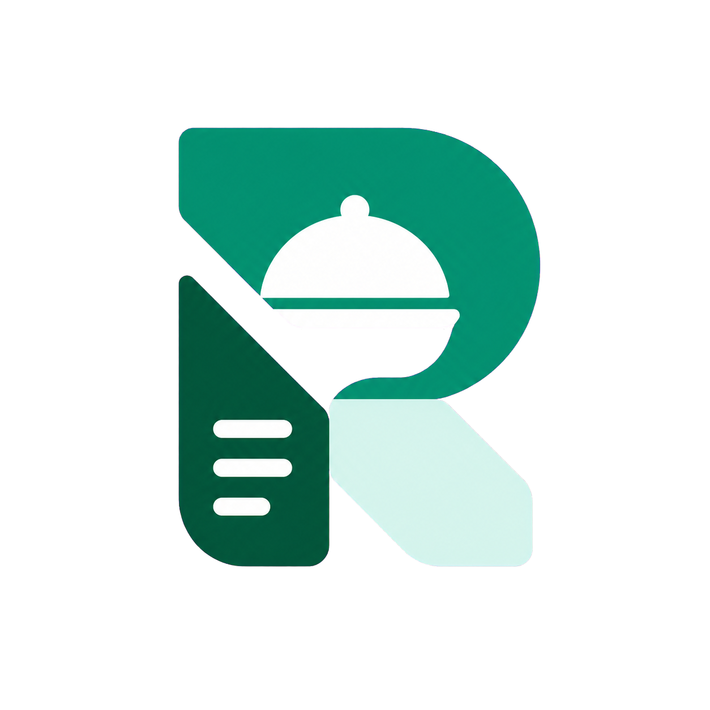

<p align="center">
  
</p>

<h1 align="center">RestoManager</h1>

<p align="center">
  A full-stack restaurant discovery, menu management, approval, and ordering platform.
</p>

## Project Overview

RestoManager connects customers, restaurant owners, and platform administrators in one role-based application. Restaurant owners can submit an application, manage an approved restaurant profile and menu, and process incoming orders. Customers can discover approved restaurants, build a cart, place orders, and follow their order history. Administrators review restaurant applications and monitor platform activity from an operational dashboard.

The repository contains three npm packages: a React frontend, an Express API, and a shared Zod validation package used by both applications.

## Table of Contents

- [Project Overview](#project-overview)
- [Table of Contents](#table-of-contents)
- [Main Features](#main-features)
- [User Roles](#user-roles)
- [Technology Stack](#technology-stack)
- [Repository Structure](#repository-structure)
- [Getting Started](#getting-started)
- [Environment Variables](#environment-variables)
- [Available Scripts](#available-scripts)
- [Application Workflow](#application-workflow)
- [API Overview](#api-overview)
- [Authentication and Authorization](#authentication-and-authorization)
- [Deployment](#deployment)
- [Team Workflow](#team-workflow)
- [Project Status](#project-status)
- [Team Members](#team-members)
- [License](#license)

## Main Features

### Customer features

- Create a customer account and sign in with email and password.
- Browse approved restaurants and filter listings by available criteria.
- View restaurant branding, opening hours, categories, menus, menu-item details, ingredients, and add-ons.
- Add configured menu items to a persistent client-side cart.
- Manage delivery addresses, including a default address.
- Review the cart and place an order through checkout.
- View current orders, order history, order confirmation, and order details.

### Restaurant-owner features

- Register an owner account and submit restaurant details and verification documents.
- Track the restaurant application's pending, approved, rejected, or suspended state.
- Access the owner workspace only after restaurant approval.
- View an operational dashboard with real order and menu statistics.
- Update restaurant information, branding, contact details, address, and opening hours.
- Open or close an approved restaurant for ordering.
- Create, edit, remove, and restore menu categories and menu items.
- Configure menu-item pricing, availability, ingredients, add-ons, and images.
- Manage kitchen orders and progress supported order statuses.

### Administrator features

- View a platform dashboard with restaurant, customer, and order statistics.
- Review restaurant-status and order-status distributions and order activity over time.
- See recent orders and the latest restaurant applications awaiting review.
- Browse restaurant applications by status.
- Inspect restaurant details and private verification documents through signed URLs.
- Approve or reject pending registrations and suspend restaurants.

## User Roles

| Role | Purpose | Main access |
| --- | --- | --- |
| `customer` | Discovers restaurants and places orders. | Public restaurant pages, cart, checkout, addresses, and personal orders. |
| `restaurant_owner` | Operates one registered restaurant. | Application status, approved-owner dashboard, profile, menu, and kitchen orders. |
| `admin` | Reviews restaurants and monitors the platform. | Admin dashboard, restaurant application list, and restaurant review pages. |

## Technology Stack

### Frontend

| Technology | Usage |
| --- | --- |
| React 19 and TypeScript | Component-based frontend application and static typing. |
| Vite 8 | Development server and production frontend build. |
| React Router 7 | Public, guest, customer, owner, and administrator routing. |
| TanStack Query 5 | API queries, caching, loading states, and mutations. |
| Axios | Configured HTTP client for API requests. |
| Zustand | Client-side cart and registration-step state. |
| React Hook Form and Zod | Form state and schema-based validation. |
| Tailwind CSS 4 and shadcn | Styling, design tokens, and reusable UI components. |
| Recharts 3 | Owner and administrator dashboard charts. |
| Better Auth client | Session-aware frontend authentication. |
| Lucide React, and Sonner | Icons, and toast notifications. |

### Backend

| Technology | Usage |
| --- | --- |
| Node.js, Express 5, and TypeScript | REST API and application server. |
| MongoDB and Mongoose | Application data, models, queries, and aggregations. |
| Better Auth with the MongoDB adapter | Email/password authentication, sessions, and role fields. |
| Supabase | Public restaurant media and private verification-document storage. |
| Multer | Multipart file-upload handling. |
| Zod | Request validation through the shared validator package. |

### Shared package

`@restomanager/validators` contains shared Zod schemas for authentication, restaurants, addresses, categories, menu items, orders, common inputs, and administrator actions.

## Repository Structure

```text
resto-manager/
├── client/                     # React and TypeScript frontend application
│   ├── public/                 # Static assets, including the project logo
│   └── src/
│       ├── auth/               # Authentication types and helpers
│       ├── components/         # Shared, layout, form, owner, and UI components
│       ├── config/             # Navigation and reusable status configuration
│       ├── hooks/              # TanStack Query and application hooks
│       ├── lib/                # Axios, Better Auth, query keys, and utilities
│       ├── pages/              # Public, authentication, customer, owner, and admin pages
│       ├── routes/             # Authentication and role route guards
│       ├── services/           # API service functions and response types
│       ├── stores/             # Zustand stores
│       └── types/              # Frontend type declarations
├── server/                     # Express and TypeScript backend API
│   └── src/
│       ├── config/             # Database configuration
│       ├── lib/                # Better Auth and Supabase clients
│       ├── middlewares/        # Auth, validation, upload, and error middleware
│       ├── modules/            # Domain models, controllers, and routes
│       ├── routes/             # Top-level API route registration
│       ├── types/              # Server type declarations
│       └── utils/              # Pagination, responses, storage, and shared helpers
├── shared/
│   └── validators/             # Shared Zod schemas published locally as @restomanager/validators
├── .gitignore
└── README.md
```

- `client/` — The frontend application, including route-based pages, reusable UI, API services, TanStack Query hooks, Zustand stores, authentication guards, and responsive dashboard interfaces.
- `server/` — The backend API, including Express routes, Mongoose models, domain controllers, authentication and role middleware, MongoDB aggregation logic, validation, uploads, and Supabase storage integration.
- `shared/` — The local `@restomanager/validators` package. It compiles shared Zod validation schemas and inferred TypeScript types for use by the client and server.

## Getting Started

### Prerequisites

- Node.js and npm
- A MongoDB database
- A Supabase project with public and private storage buckets

There is no root `package.json`, so install and run each package from its own directory. The client and server both depend on the local package at `shared/validators`.

### 1. Set up the shared validator package

From the repository root:

```bash
cd shared/validators
npm install
npm run build
```

Rebuild this package after changing a shared schema. During schema development, `npm run dev` runs the TypeScript compiler in watch mode.

### 2. Set up the backend

```bash
cd server
npm install
```

Create `server/.env` using the variables documented below, then start the development server:

```bash
npm run dev
```

The server uses port `5000` when `PORT` is not set.

### 3. Set up the frontend

```bash
cd client
npm install
```

Create `client/.env`, set the API base URL, and start Vite:

```bash
npm run dev
```

With the default local ports, the client API URL is typically `http://localhost:5000/api`.

## Environment Variables

Never commit real credentials. Local `.env` files are ignored by Git.

### Client: `client/.env`

| Variable | Required | Purpose | Placeholder |
| --- | --- | --- | --- |
| `VITE_API_URL` | Yes | Base URL used by Axios, the health check, and the Better Auth client. Include the `/api` prefix. | `http://localhost:5000/api` |

```dotenv
VITE_API_URL=http://localhost:5000/api
```

### Server: `server/.env`

| Variable | Required | Purpose | Placeholder |
| --- | --- | --- | --- |
| `PORT` | No | Express listening port; defaults to `5000`. | `5000` |
| `NODE_ENV` | No | Selects development or production authentication-origin behavior. | `development` |
| `CLIENT_URL` | Production | Trusted frontend origin used by Better Auth in production. | `https://app.example.com` |
| `MONGO_URI` | Yes | MongoDB connection string used by Mongoose and the Better Auth adapter. | `mongodb://127.0.0.1:27017/restomanager` |
| `SUPABASE_URL` | Yes | Supabase project URL used by the storage client. | `https://project-id.supabase.co` |
| `SUPABASE_SERVICE_ROLE_KEY` | Yes | Server-only Supabase service-role credential. | `your-service-role-key` |
| `SUPABASE_PUBLIC_BUCKET` | No | Bucket for public restaurant and menu media; code defaults to `restaurant-media`. | `restaurant-media` |
| `SUPABASE_PRIVATE_BUCKET` | Yes for verification files | Private bucket for restaurant verification documents. | `restaurant-documents` |

```dotenv
PORT=5000
NODE_ENV=development
CLIENT_URL=http://localhost:5173
MONGO_URI=mongodb://127.0.0.1:27017/restomanager
SUPABASE_URL=https://project-id.supabase.co
SUPABASE_SERVICE_ROLE_KEY=your-service-role-key
SUPABASE_PUBLIC_BUCKET=restaurant-media
SUPABASE_PRIVATE_BUCKET=restaurant-documents
```

## Available Scripts

Run each command from the package directory shown.

### `client/`

| Command | Description |
| --- | --- |
| `npm run dev` | Starts the Vite development server. |
| `npm run build` | Runs the TypeScript project build and creates the Vite production bundle. |
| `npm run lint` | Runs ESLint across the frontend. |
| `npm run preview` | Serves the production frontend bundle locally for preview. |

### `server/`

| Command | Description |
| --- | --- |
| `npm run dev` | Runs the TypeScript server with `tsx` watch mode. |
| `npm run build` | Compiles TypeScript and rewrites configured path aliases with `tsc-alias`. |
| `npm start` | Runs the compiled server from `dist/server.js`. |

### `shared/validators/`

| Command | Description |
| --- | --- |
| `npm run build` | Compiles the shared validators to `dist/`. |
| `npm run dev` | Watches and recompiles shared validator changes. |

No automated test script is currently defined in the package files.

## Application Workflow

```text
Restaurant registration
        ↓
Administrator review and approval
        ↓
Restaurant profile, opening hours, categories, and menu management
        ↓
Customer restaurant discovery and menu browsing
        ↓
Cart configuration and order placement
        ↓
Restaurant kitchen order-status management
        ↓
Customer current-order and order-history views
```

1. A restaurant owner creates an account and submits restaurant, contact, address, branding, and private verification information.
2. An administrator reviews the application and approves or rejects it. Approved owners gain access to the operational workspace; suspended owners lose approved-workspace access.
3. The owner completes the restaurant profile, configures opening hours, organizes categories and menu items, and opens the restaurant for ordering.
4. Customers browse approved restaurants and menus, configure items, and add items from one restaurant to their cart.
5. An authenticated customer selects a delivery address and places an order.
6. The restaurant processes the order through the supported kitchen statuses, while the customer views current and historical order information.

## API Overview

All application routes are mounted under `/api`. Better Auth handles authentication routes under `/api/auth/*`.

| Access | Method and path | Purpose |
| --- | --- | --- |
| Public | `GET /api/health` | Server health response. |
| Public | `GET /api/restaurants` | Paginated approved restaurant discovery. |
| Public | `GET /api/restaurants/filter-options` | Available restaurant filter values. |
| Public | `GET /api/restaurants/:slug` | Public restaurant and menu details. |
| Registration | `POST /api/owner/restaurant/register` | Creates an owner account and restaurant application with uploaded files. |
| Owner | `GET/PATCH /api/owner/restaurant` | Reads or updates the authenticated owner's restaurant. |
| Owner | `GET /api/owner/restaurant/status` | Reads the restaurant application status. |
| Owner | `GET /api/owner/restaurant/menu` | Reads the owner's organized menu. |
| Owner | `PATCH /api/owner/restaurant/open-status` | Opens or closes an approved restaurant. |
| Owner | `GET /api/owner/dashboard` | Returns owner dashboard aggregates. |
| Owner | `/api/owner/categories` | Lists, creates, updates, removes, and restores categories. |
| Owner | `/api/owner/menu-items` | Lists, creates, reads, updates, removes, and restores menu items. |
| Owner | `GET /api/owner/orders/kitchen` | Returns active kitchen orders. |
| Owner | `PATCH /api/owner/orders/:orderId/status` | Advances or cancels an order according to supported transitions. |
| Customer | `POST /api/customer/orders` | Places an order. |
| Customer | `GET /api/customer/orders/current` | Returns current orders. |
| Customer | `GET /api/customer/orders/history` | Returns completed or cancelled order history. |
| Customer | `GET /api/customer/orders/:orderId` | Returns one order owned by the customer. |
| Customer | `/api/customer/addresses` | Lists, creates, updates, defaults, and deletes delivery addresses. |
| Admin | `GET /api/admin/dashboard` | Returns platform dashboard aggregates. |
| Admin | `GET /api/admin/restaurants` | Lists restaurant applications with pagination and status filtering. |
| Admin | `GET /api/admin/restaurants/:restaurantId` | Returns restaurant review details. |
| Admin | `PATCH /api/admin/restaurants/:restaurantId/status` | Approves or rejects a restaurant application. |
| Admin | `PATCH /api/admin/restaurants/:restaurantId/suspend` | Suspends a restaurant. |

Request validation is applied where a shared Zod schema is configured. Controllers also enforce ownership, valid identifiers, supported statuses, and other domain-specific rules.

## Authentication and Authorization

- Better Auth provides email/password accounts and session handling through its MongoDB adapter.
- New standard accounts default to the `customer` role. The allowed roles are `customer`, `restaurant_owner`, and `admin`.
- The server determines authorization from the authenticated session; it does not trust a client-supplied role.
- `requireRole(...)` protects customer, restaurant-owner, and administrator API groups.
- Frontend `ProtectedRoute`, `RoleRoute`, and `RequireApprovedOwner` guards provide role-aware navigation and user experience, while backend middleware remains the security boundary.
- Owner registration is public because it creates the owner account and restaurant application. Subsequent owner operations require the `restaurant_owner` role.
- Private verification files are retrieved through time-limited signed URLs instead of public storage links.

## Deployment

The repository does not currently include a provider-specific deployment configuration, container definition, or continuous-deployment workflow. A deployment should build and host the three packages as follows.

### Shared validators

```bash
cd shared/validators
npm install
npm run build
```

Build the shared package before installing or building consumers when setting up a clean deployment environment.

### Backend API

```bash
cd server
npm install
npm run build
npm start
```

Provide all required server environment variables at runtime. The deployment environment must be able to reach MongoDB and Supabase.

### Frontend application

```bash
cd client
npm install
npm run build
```

Deploy the generated `client/dist/` directory to a static host. Configure the host to serve `index.html` for client-side React Router paths. Because Vite embeds client environment variables at build time, set `VITE_API_URL` to the deployed API base URL before running the build.

For production authentication, set `NODE_ENV=production` and configure `CLIENT_URL` to the exact deployed frontend origin.

## Team Workflow

The repository does not currently contain a contribution guide or CI workflow. A practical team workflow is:

1. Pull the latest shared branch before starting work.
2. Create a focused feature or fix branch.
3. Update shared schemas first when an API contract changes, then rebuild `shared/validators`.
4. Keep server controllers, client service types, and shared validation rules aligned.
5. Run the relevant package checks before opening a pull request:

   ```bash
   cd shared/validators && npm run build
   cd ../../server && npm run build
   cd ../client && npm run lint && npm run build
   ```

6. Review authentication, role protection, ownership checks, empty states, and responsive behavior for affected flows.
7. Avoid committing `.env` files, credentials, generated local data, or unrelated changes.

## Project Status

RestoManager is under active development. Core restaurant registration and review, profile and menu management, restaurant discovery, cart and checkout, customer order history, kitchen order processing, and owner/admin dashboard flows are implemented.

The package files currently define build and lint scripts but no automated test suite or CI pipeline. Production deployment configuration is also not included in the repository.

## Team Members

Team-member names and responsibilities are not documented in the repository. Add confirmed contributors here rather than inferring names from local Git configuration or package metadata.

## License

No repository-level `LICENSE` file is currently present. Do not assume permission to use, modify, or distribute this project until the project owners add or identify an applicable license.
